## Task 1 :
ArticatHub üzerinden resmi nginx char'ının K3S üzerine kurulumu
<hr>

### Görev Adımları
1) Bitnami repo'sunun helm'e eklenmesi
```bash
helm repo add bitnami https://charts.bitnami.com/bitnami
helm repo update
```

2) bitnami/nginx chart'ının kurulumu
```bash
helm install my-nginx bitnami/nginx --version 22.4.3
```

3) Kurulumların doğrulanması
```bash
helm ls #release listesi
kubectl get pods 
```

4) Helm Status çıktısının incelenmesi
```bash
helm status my-nginx
```
```bash
NAME: my-nginx
LAST DEPLOYED: Wed Jan 21 13:58:21 2026
NAMESPACE: default
STATUS: deployed
REVISION: 1
TEST SUITE: None
NOTES:
CHART NAME: nginx
CHART VERSION: 22.4.3
APP VERSION: 1.29.4

⚠ WARNING: Since August 28th, 2025, only a limited subset of images/charts are available for free.
    Subscribe to Bitnami Secure Images to receive continued support and security updates.
    More info at https://bitnami.com and https://github.com/bitnami/containers/issues/83267

** Please be patient while the chart is being deployed **
NGINX can be accessed through the following DNS name from within your cluster:

    my-nginx.default.svc.cluster.local (port 80)
```

#### Soru : Buradaki NOTES kısmı ne işe yarar?
- uygulamaya nasıl erişim sağlanacağı hakkında bilgi
- deployment süreci hakkında bilgi
- önemli uyarılar
- chart’a özel best practice önerileri, bulundurur.

5) Port Forward ile localden erişim
```bash
kubectl edit svc my-nginx
```
```bash
 ports:
  - name: http
    nodePort: 30080
    port: 80
    protocol: TCP
    targetPort: http
```
> Vagrantfile'ın düzenlenmesi
```bash
config.vm.network "forwarded_port", guest: 30080, host: 8080, host_ip: "127.0.0.1"
```
> vagrant reload işlemi
```bash
vagrant reload
```

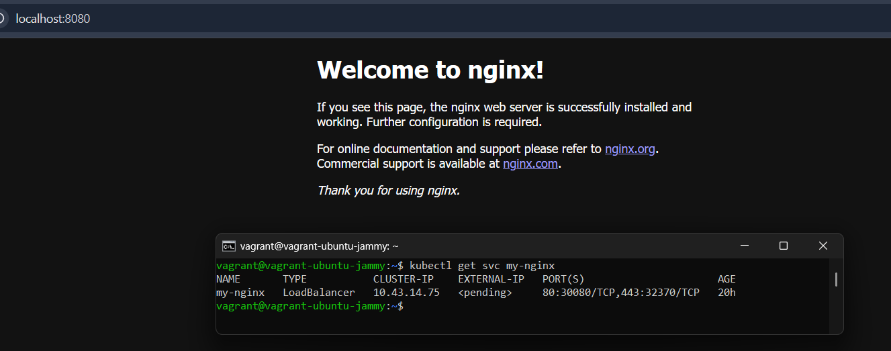

## Task 2 :
Kurulu bir uygulamanın özelliklerini dışarıdan müdahale ederek değiştirmek.
<hr>

### Görev Adımları
1) mevcut value'ları inceleme
```bash
helm show values bitnami/nginx > default-values.yaml
```
2) Yaml dosyasını düzenleme
> görev kapsamında bizde istenen replica sayısını 1'den 3'e çıkarmak, uygulamanın 1 CPU 2 RAM ile çalışmasını sağlamak ancak vm'in sahip olduğu donanımsal kaynaklardan dolayı cpu ve ram miktarı şu şekilde düzenlenmiştir : 0.2 CPU - 128Mi RAM

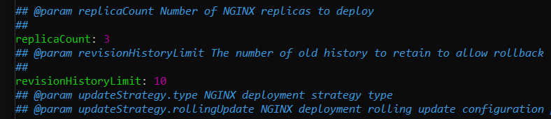
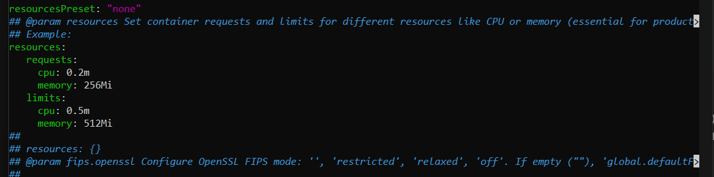

> Resorces alanında yer alan *resourcesPreset : nano*, bitnami chart'larında bu ayar, kaynakları otomatik olarak çok düşük (nano) seviyeye çeker. Yaptığımız değişiklikleri ezmemesi adına bu "none" olarak güncellememiz gerekir.

3) Değişikliklerin uygulanması
```bash
helm upgrade my-nginx bitnami/nginx -f values.yaml 
```
> upgrade çıktısı
```bash
vagrant@vagrant-ubuntu-jammy:~$ helm upgrade my-nginx bitnami/nginx -f default-values.yaml
Release "my-nginx" has been upgraded. Happy Helming!
NAME: my-nginx
LAST DEPLOYED: Thu Jan 22 14:05:07 2026
NAMESPACE: default
STATUS: deployed
REVISION: 2
TEST SUITE: None
NOTES:
CHART NAME: nginx
CHART VERSION: 22.4.3
APP VERSION: 1.29.4

⚠ WARNING: Since August 28th, 2025, only a limited subset of images/charts are available for free.
    Subscribe to Bitnami Secure Images to receive continued support and security updates.
    More info at https://bitnami.com and https://github.com/bitnami/containers/issues/83267

** Please be patient while the chart is being deployed **
NGINX can be accessed through the following DNS name from within your cluster:

    my-nginx.default.svc.cluster.local (port 80)
```
4) Güncel pod'ların incelenmesi
```bash
kubectl get pods --watch
```
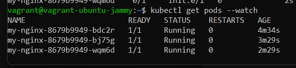


## Task 3 :
Basit bir uygulamanın helm chart'a dönüştürülmesi
<hr>

1) Go uygulamasının oluşturulması
> Bunun için [task-3](./task-3/) klasörü altında *main.go* dosyasını oluşturduk.

2) Helm Chart oluşturabilmemiz için öncesinde elimizde Kubernetes tarafından orkestre edilebilecek bir docker image'ımızın olması gerekir. Bu sebeple oluşturduğumuz projemizin build'ini alabilmek için aşağıdaki *Dockerfile* dosyasını oluşturduk.

```bash
#Dockerfile
FROM golang:1.21-alpine AS builder
WORKDIR /app
COPY . .

RUN CGO_ENABLED=0 GOOS=linux go build -o main .

#Runner
FROM alpine:latest
WORKDIR /root/
COPY --from=builder /app/main .

EXPOSE 8081
CMD ["./main"]
```

3) Docker image'ının oluşturulması
```bash
DOCKER_BUILDKIT=1 docker build -t <"my-username">/hello-go:v1
```

4) Image'ın registry'ye aktarılması
```bash
docker push <"my-username">/hello-go:v1
```

5) Helm Chart oluşturma - Gereksiz dosyaların temizlenmesi
```bash
helm create my-app

# Gereksizleri dosyaları temizleme
rm -rf my-go-app/charts
rm -rf templates/serviceaccount.yaml
rm -rf templates/ingress.yaml
rm -rf templates/hpa.yaml
rm -rf templates/tests
rm -rf templates/httproute.yaml
```

6) *values.yaml* dosyasının yapılandırılması
```bash
replicaCount: 1

image:
  repository: colakk35/hello-go
  tag: "v1"
  pullPolicy: Always

service:
  type: NodePort
  port: 80
  targetPort: 8081
  nodePort: 30080

appConfig:
  message: "Bu uygulama helm ile paketlendi!"
```

7) *deployment.yaml* dosyasının yapılandırılması
```bash
apiVersion: apps/v1
kind: Deployment
metadata:
  name: {{ include "my-app.fullname" . }}
  labels:
    {{- include "my-app.labels" . | nindent 4 }}
spec:
  replicas: {{ .Values.replicaCount }}
  selector:
    matchLabels:
      {{- include "my-app.selectorLabels" . | nindent 6 }}
  template:
    metadata:
      labels:
        {{- include "my-app.labels" . | nindent 8 }}
    spec:
      containers:
        - name: {{ .Chart.Name }}
          image: "{{ .Values.image.repository }}:{{ .Values.image.tag }}"
          imagePullPolicy: {{ .Values.image.pullPolicy }}
          ports:
            - name: http
              containerPort: {{ .Values.service.port }}
              protocol: TCP
          env:
            - name: TARGET
              value: {{ .Values.appConfig.targetMessage | quote }}   
```
8) *service.yaml* dosyasının yapılandırılması 
```bash
apiVersion: v1
kind: Service
metadata:
  name: {{ include "my-app.fullname" . }}
  labels:
    {{- include "my-app.labels" . | nindent 4 }}
spec:
  type: {{ .Values.service.type }}
  ports:
    - port: {{ .Values.service.port }}
      targetPort: {{ .Values.service.targetPort }}
      nodePort: {{ .Values.service.nodePort }}
      protocol: TCP
      name: http
  selector:
    {{- include "my-app.selectorLabels" . | nindent 4 }}
```

9) Helm Chart'ın kurulumu ve kurulumun kontrol edilmesi
```bash
helm lint . #syntax hatası kontrolü
helm upgrade --install go-demo .
kubectl get pods
kubectl get svc go-demo #pod detaylarını incelemek için
```
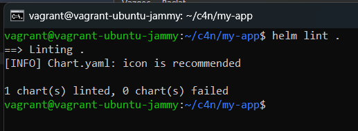

10) Projenin canlıda test edilmesi
> Bundan önceki adımda sanal makinemizin 30080 portu ile bilgisayarımızın 8080 portu arasında bir köprü kurmuştuk.
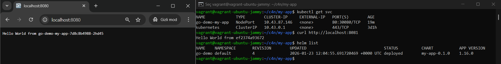

## Task 4 :
Release ve Rollback işlemlerinin pratiğe dökülmesi
<hr>

1) *values.yaml* dosyamızda yer alan image'ımıza ait olan tag'ı yanlış olacak şekilde düzenliyoruz!
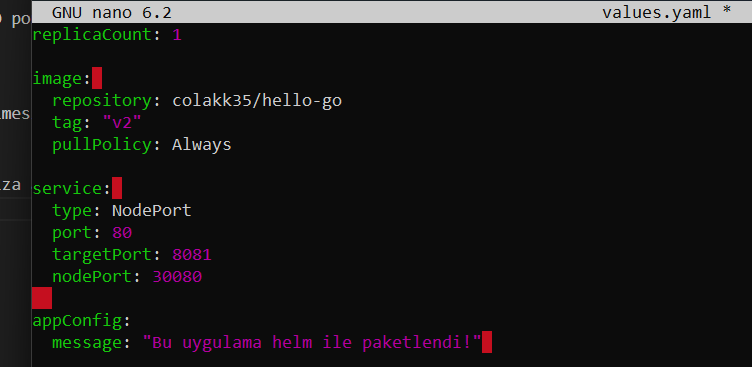

2) Artık yanlış bir version vererek sürüm güncellemesi yapacağımız yaml dosyamız hazır, Uygulamanın güncellenmesi
```bash
helm upgrade go-demo .
```
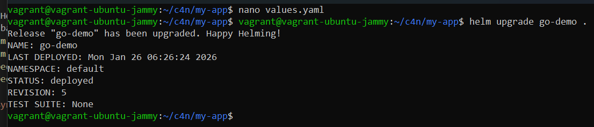
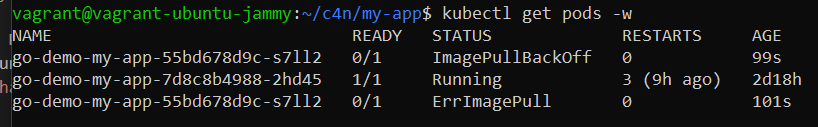

3) Uygulama **Release** geçmişinin incelenmesi ve **Rollback** işlemi
```bash
helm history go-demo
```
```bash
helm rollback go-demo <"revision-number">
```

4) Pod'ların kontrol edilmesi
```bash
kubectl get pods
```
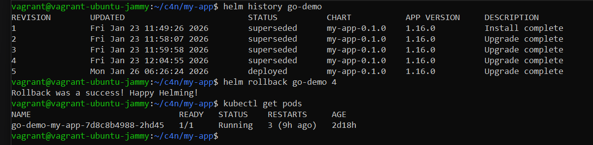

5) Uygulamanın çalıştığı *güncel values* değerlerinin incelenmesi
```bash
kubectl get values go-demo --all
```
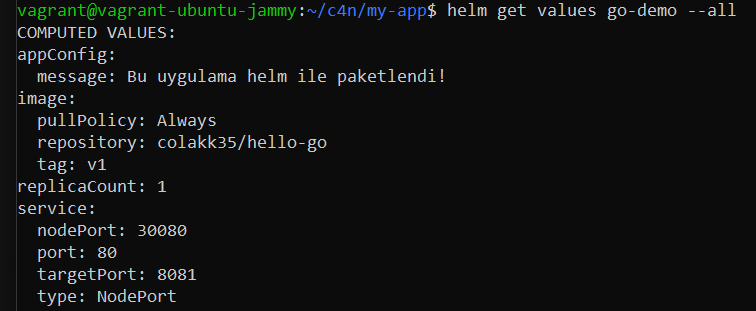
