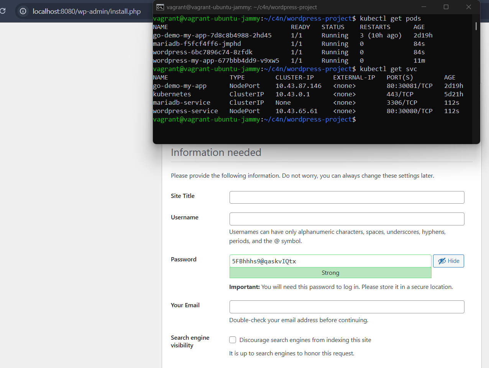
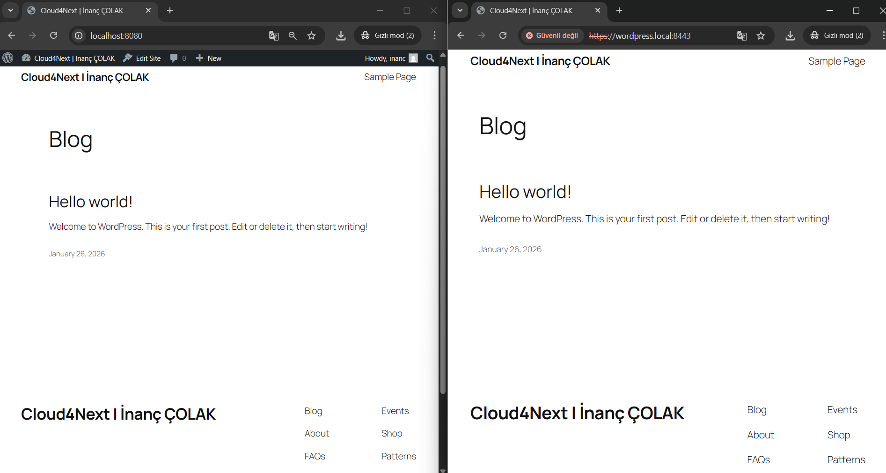

## Final Task
1) Helm Chart'ın oluşturulması
```bash
helm create wordpress-project
```
2) Dosyaların yapılandırılması
> *values.yaml*
```bash
# -- DB --
mariadb:
  image: mariadb:10.6
  rootPassword: "inanc123!"
  user: "wp_user"
  password: "wppass123!"
  dbName: "wp_"

# -- Wordpress --
wordpress:
  image: wordpress:latest
  service:
    type: NodePort
    port: 80
    nodePort: 30080

# -- ingress --
ingress:
  host: wordpress.local
```
> *templates/secret.yaml* --> deployment sırasında önemli verilerimizi açık bir şekilde belirtmemek için kullanılır. k8s secret nesnesi oluşturup değerleri values.yaml dosyasından alırız.
```bash
apiVersion: v1
kind: Secret
metadata:
  name: mariadb-pass-secret
type: Opaque
stringData:
  mariadb-root-password: {{ .Values.mariadb.rootPassword }}
  mariadb-password: {{ .Values.mariadb.password }}
```
> *templates/wordpress.yaml*
```bash
apiVersion: v1
kind: Service
metadata:
  name: wordpress-service
spec:
  type: {{ .Values.wordpress.service.type }}
  ports:
    - port: {{ .Values.wordpress.service.port }}
      targetPort: 80
      nodePort: {{ .Values.wordpress.service.nodePort }}
  selector:
    app: wordpress
---
apiVersion: apps/v1
kind: Deployment
metadata:
  name: wordpress
spec:
  selector:
    matchLabels:
      app: wordpress
  template:
    metadata:
      labels:
        app: wordpress
    spec:
      containers:
        - image: {{ .Values.wordpress.image }}
          name: wordpress
          env:
            - name: WORDPRESS_DB_HOST
              value: mariadb-service
            - name: WORDPRESS_DB_USER
              value: {{ .Values.mariadb.user }}
            - name: WORDPRESS_DB_NAME
              value: {{ .Values.mariadb.dbName }}
            - name: WORDPRESS_DB_PASSWORD
              valueFrom:
                secretKeyRef:
                  name: mariadb-pass-secret
                  key: mariadb-password
          ports:
            - containerPort: 80
              name: wordpress
```
> *templates/mariadb.yaml*
```bash
apiVersion: v1
kind: Service
metadata:
  name: mariadb-service
spec:
  ports:
    - port: 3306
  selector:
    app: mariadb
  clusterIP: None
---
apiVersion: apps/v1
kind: Deployment
metadata:
  name: mariadb
spec:
  selector:
    matchLabels:
      app: mariadb
  template:
    metadata:
      labels:
        app: mariadb
    spec:
      containers:
        - image: {{ .Values.mariadb.image }}
          name: mariadb
          env:
            - name: MARIADB_ROOT_PASSWORD
              valueFrom:
                secretKeyRef:
                  name: mariadb-pass-secret
                  key: mariadb-root-password
            - name: MARIADB_PASSWORD
              valueFrom:
                secretKeyRef:
                  name: mariadb-pass-secret
                  key: mariadb-password
            - name: MARIADB_USER
              value: {{ .Values.mariadb.user }}
            - name: MARIADB_DATABASE
              value: {{ .Values.mariadb.dbName }}
          ports:
            - containerPort: 3306
              name: mariadb
```

3) Kurulum ve Pod Kontrolleri
```bash
helm install wordpress-project .
kubectl get pods
kubectl get svc
```

4) Self-Signed SSL Sertifikasının Oluşturulması
```bash
openssl req -x509 -nodes -days 365 -newkey rsa:2048 \
  -keyout tls.key -out tls.crt \
  -subj "/CN=wordpress.local/O=MyCompany"

# oluşturulan sertifikanın k8s'e secret onjesi olarak kaydedilmesi
kubectl create secret tls my-tls-secret --key tls.key --cert tls.crt
```

5) Ingress Controller Kurulumu
```
helm repo add ingress-nginx https://kubernetes.github.io/ingress-nginx
helm repo update
helm install my-ingress ingress-nginx/ingress-nginx
```
6) Ingress.yaml Dosyasının Oluşturulması
> *templates/ingress.yaml*
```bash
apiVersion: networking.k8s.io/v1
kind: Ingress
metadata:
  name: wordpress-ingress
  annotations:
    kubernetes.io/ingress.class: nginx
    nginx.ingress.kubernetes.io/ssl-redirect: "true"
    nginx.ingress.kubernetes.io/use-forwarded-headers: "true"
    nginx.ingress.kubernetes.io/proxy-redirect-from: "http://"
    nginx.ingress.kubernetes.io/proxy-redirect-to: "https://"
spec:
  ingressClassName: nginx
  tls:
  - hosts:
      - {{ .Values.ingress.host }}
    secretName: my-tls-secret 
  rules:
  - host: {{ .Values.ingress.host }}
    http:
      paths:
      - path: /
        pathType: Prefix
        backend:
          service:
            name: wordpress-service
            port:
              number: 80
```
> Projenin Güncellenmesi
```bash
helm upgrade wordpress-project .
```
7) DNS Spoofing
*C:\Windows\System32\drivers\etc* altındaki hosts dosyasına oluşturulan dns'in bilgileri girilir
```bash
127.0.0.1 wordpress.local
```

8) Port Forward
```bash
vagrant ssh -- -L 8443:127.0.0.1:8443 #öncesinde VM içinden exit ile çıkış yapmak gerekir.
kubectl port-forward svc/my-ingress-ingress-nginx-controller 8443:443 --address 0.0.0.0 &
```

